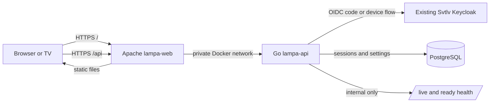

# Lampa Svtlv Account and Settings Sync Design

Status: Draft for review  
Date: 2026-09-13  
Target branch: `svtlvtv`

## 1. Decision summary

Add an optional Svtlv account and cloud-settings capability without replacing
Lampa's local-first behavior.

The target design is:

- the existing Apache container continues to serve the static Lampa
  distribution;
- a separate Go service owns authentication, sessions, settings validation and
  persistence;
- Apache proxies `/api/*` to the Go service so the browser sees one Lampa
  origin;
- the Go service uses a new confidential client in the existing Svtlv Keycloak
  realm;
- the Keycloak `sub` UUID is the canonical user identifier, matching the Svtlv
  web application;
- PostgreSQL stores one versioned `jsonb` settings document per user;
- credentials and private connection configuration are encrypted by the Go
  application before being stored;
- `localStorage` remains the runtime cache and offline fallback;
- only explicitly classified keys are synchronized. Unknown keys are local by
  default;
- browser redirect login is delivered first. TV-friendly device authorization
  is added after the core sync path works.

This design intentionally does not add MongoDB or another document-database
service. PostgreSQL `jsonb` gives us a JSON-per-user model while reusing the
database technology, backup knowledge and operational conventions already used
by Svtlv.

## 2. Why this design is needed

Today, Lampa stores preferences, runtime state, caches, account data and
connection credentials together in browser `localStorage`. A setting configured
on one television or browser does not appear on another device. Clearing browser
storage also removes the configuration.

The desired result is that a user can sign in with the same Svtlv identity on
multiple devices and receive the same appropriate settings, including an
opt-in path for TorrServer and parser connection configuration.

The implementation must respect this repository's unusual constraints:

- this is a distribution repository, not the Lampa source repository;
- `app.min.js` is generated-but-readable ES5 and is edited directly;
- old TV browsers constrain JavaScript and authentication choices;
- Lampa can run without a backend today and must continue to work when the new
  API or Keycloak is unavailable;
- third-party Lampa plugins execute inside the application origin and must be
  treated as untrusted;
- upstream frequently replaces the complete application bundle, so local
  integration changes must remain small and easy to reapply.

The current Lampa deployment already follows important parts of the Svtlv
delivery style: manual GitHub Actions deployment, immutable GHCR image tags,
Tailscale plus SSH, Docker Compose and container health checks. The new service
should extend that pattern rather than create another deployment system.

## 3. Goals

1. Let existing Svtlv users sign in without creating a second password or user
   database.
2. Synchronize a documented set of settings across a user's devices.
3. Preserve guest mode, offline startup and local settings when the backend is
   unavailable.
4. Support both normal browsers and, in a later step, televisions with awkward
   text entry or limited embedded browsers.
5. Protect centrally stored connection credentials at rest and keep them out of
   logs, metrics and health responses.
6. Make concurrent changes deterministic and prevent one device from silently
   replacing unrelated changes made by another.
7. Use plan-sized phases with testable exit criteria and safe rollback points.
8. Keep Svtlv identity and Lampa application data separate: Keycloak owns users;
   Lampa owns settings.

## 4. Non-goals for the first release

- Replacing CUB accounts, bookmarks, viewing history or CUB synchronization.
- Copying all `localStorage` keys to the server.
- Proxying torrents, TorrServer traffic or media through the Go service.
- Building a general user-profile or household/profile system.
- Real-time push synchronization between open devices.
- An administration UI for inspecting or editing user settings.
- Storing user passwords or calling the Keycloak Admin API during normal
  requests.
- Making cloud login mandatory to use Lampa.
- Reconstructing or checking out `lampa-source` as part of this work.

These can become separate designs after settings synchronization proves useful.

## 5. Approaches considered

### 5.1 Recommended: same-origin Go backend with server sessions

The browser navigates to the Go backend to start the OpenID Connect
Authorization Code flow. The backend exchanges the code, validates the identity
and gives the browser an opaque, `HttpOnly` session cookie. Keycloak tokens stay
server-side and are not written to `localStorage`.

Advantages:

- aligns with the cookie-backed OpenID Connect pattern already used by Svtlv;
- avoids exposing Keycloak access and refresh tokens to Lampa or plugins;
- avoids normal CORS complexity because the static app and API share an origin;
- lets the Go service enforce one settings contract for every client;
- can later broker Keycloak Device Authorization for televisions.

Costs:

- introduces server-side session storage and CSRF protection;
- native shells loaded from `file://` may not support the same cookie behavior;
- Apache needs a small reverse-proxy configuration.

### 5.2 Direct browser OIDC with a public Keycloak client

The JavaScript application would use Authorization Code plus PKCE and call the
Go API with bearer tokens.

This has fewer session endpoints, but it puts tokens inside a large legacy
JavaScript application that deliberately runs untrusted plugins. It also adds
token refresh, CORS and old-browser compatibility work to `app.min.js`. It is
not recommended for the normal hosted application.

### 5.3 Device Authorization only

Every device would show a code that the user approves in another browser. This
fits televisions well but is needlessly awkward on desktop and mobile browsers.
It is retained as a second authentication path, not the only path.

## 6. Target architecture



Production rules:

- only the Lampa HTTPS origin is public for application traffic;
- the API container has no public host port;
- the database has no new public port;
- the existing public Keycloak realm endpoints remain reachable through the
  Svtlv gateway, while Keycloak admin and management paths remain private;
- service-to-service database and Keycloak addresses use the private network
  where the deployment topology permits it;
- TLS termination and forwarded headers have one documented trust boundary.

## 7. Components

### 7.1 `lampa-web`

Responsibilities remain static file delivery plus reverse proxying `/api/*`.
It must not interpret sessions or contain secrets. A dedicated Apache
configuration should enable only the proxy modules and paths required by the
API.

### 7.2 `lampa-api`

A small Go HTTP service with these packages or equivalent boundaries:

- `auth`: OIDC discovery, callback validation, logout and device flow;
- `session`: opaque browser/device sessions and expiry;
- `settings`: allowlist, type validation, schema migration and merge rules;
- `crypto`: encryption/decryption of sensitive settings and key rotation;
- `store/postgres`: transactional persistence;
- `httpapi`: routes, middleware, request limits and error envelopes;
- `health`: liveness and database readiness.

Use the Go standard library where practical. Dependencies should be limited to a
PostgreSQL driver, an OIDC/OAuth implementation, migrations and focused test
support. Framework selection is an implementation-plan decision, not an
architectural requirement.

### 7.3 PostgreSQL

Production should use a dedicated logical database and least-privileged role,
even if it shares the existing Svtlv PostgreSQL server. Local Compose may run a
dedicated PostgreSQL container for self-contained development.

This cross-repository production choice must be resolved in Step 0:

- preferred: add a dedicated `lampa` database and role to the managed Svtlv
  PostgreSQL instance;
- fallback: deploy an independent `lampa-db` container and named volume.

Do not reuse a broad database credential merely because another Svtlv service
already has it.

### 7.4 Lampa cloud-settings adapter

Keep the fork-specific browser integration in a clearly marked ES5 module. The
preferred implementation is a small additional file under `svtlv/`, loaded
after `app.min.js`, rather than a large block inserted into the generated bundle.
The compatibility spike must prove that this load point is early enough for the
required events and works when Android supplies a remote Lampa script URL.

The adapter should use existing primitives such as `Lampa.Storage`,
`Lampa.SettingsApi`, `Lampa.Listener`, jQuery AJAX and remote-focusable
`.selector` controls. It must not require modern JavaScript syntax or a new
frontend build system.

## 8. Identity and authentication

### 8.1 Keycloak integration

Create a separate confidential client, tentatively named `svtlv-lampa`, in the
existing `svtlv` realm. Do not reuse the Svtlv web client secret.

Required properties:

- Authorization Code flow enabled;
- exact Lampa callback and post-logout redirect URIs;
- PKCE S256 required where supported by the selected Go client flow;
- Device Authorization enabled before the TV phase;
- Direct Access Grants and Implicit flow disabled;
- normal `openid profile email` scopes only unless a later feature justifies
  more;
- no Keycloak Admin API permission.

The backend validates issuer, audience/client, signature, expiry, nonce/state and
the `sub` claim. As in Svtlv web, `sub` must parse as a UUID. That UUID is stored
as `user_sub`; email and username are display data, not identity keys.

There is no Lampa users table. Deleting a Keycloak user may leave orphaned
settings until a future retention/cleanup process is defined.

### 8.2 Browser session flow

1. Lampa calls `GET /api/v1/session`.
2. An anonymous response leaves the application in guest/local mode.
3. The user activates **Sign in with Svtlv**.
4. The browser navigates to `GET /api/v1/auth/login`.
5. The backend performs Authorization Code plus PKCE with Keycloak.
6. The callback validates the identity and creates an opaque application
   session.
7. The backend redirects to a fixed, prevalidated Lampa path.
8. Lampa fetches settings and runs first-login reconciliation if needed.

Cookie baseline:

- `HttpOnly`, `Secure`, `SameSite=Lax`, host-only and `Path=/`;
- random 256-bit session identifier; only its hash is stored;
- idle and absolute expiration;
- rotation after login and other privilege-boundary events;
- logout revokes the local session. Keycloak single logout is optional in the
  first increment and must be explicit if added.

All state-changing API requests require a CSRF defense. Prefer a session-bound
anti-forgery token carried in a custom header, plus strict Origin/Referer checks
when those headers are present. CORS is denied by default.

### 8.3 Television/device flow

Televisions should not require users to type a Keycloak password with a remote.

1. The TV asks the Go service to start device authorization.
2. The service requests a Keycloak device code and stores the attempt
   server-side.
3. Lampa displays the short code and a QR code for the verification URL.
4. The user signs in and approves on a phone or computer.
5. The TV polls the Go service; the Go service enforces Keycloak's interval and
   expiry.
6. On success, the service validates the returned identity and creates a
   Lampa-scoped device session.

The device never receives a reusable Keycloak refresh token. If a hosted TV
browser accepts the normal same-origin cookie, use it. If packaged `file://` or
remote-script modes cannot do so, a later compatibility path may issue a
revocable opaque device credential with settings-only scope. That credential is
not a Keycloak token, is stored only after explicit device linking and must be
shown in a **Linked devices** revocation screen.

This fallback is a decision gate, not an assumption: first test real target
devices and the Android shell.

## 9. Settings classification

Synchronizing `Object.keys(localStorage)` is forbidden. New keys are never
synced until added to the server and client registries with type, size,
sensitivity and scope.

| Class | Examples | Persistence rule |
| --- | --- | --- |
| Global preference | language, catalog source, subtitle preference, poster/UI choices that make sense everywhere | Store in `settings jsonb` |
| Private connection | TorrServer URLs/login/password, Jackett or Prowlarr URL/API key | Encrypt as a separate secret document; explicit opt-in |
| Device-local | platform/native, device name, navigation/keyboard mode, player executable/path, internal player, performance/light settings | Keep only on the device |
| Runtime/cache | activity stack, request caches, timestamps, search caches, temporary playback state | Never sync |
| Foreign account/security | CUB account/token, terminal access, parental PIN, consent markers | Never sync in this system |
| Plugin-owned/unknown | plugin list, blacklist and arbitrary plugin keys | Never sync by default |

The exact initial allowlist must be produced from the current settings templates
and `SettingsApi.addParam` registrations during Step 3. The table above is policy,
not the final key inventory.

### 9.1 Precedence

At runtime:

```text
Lampa defaults < cloud global settings < device-local overrides
```

`localStorage` continues to contain the effective values needed by the existing
application. The cloud service is not queried on every `Storage.get` call.

### 9.2 First-login reconciliation

Never silently erase either side. On the first sign-in for a device:

- no cloud document: offer **Save this device to cloud**;
- existing cloud document: offer **Use cloud settings** or **Keep this device
  and replace cloud settings**;
- cancel: remain signed in but leave sync disabled on that device.

The choice and last synchronized revision are stored locally. Connection-secret
sync has a separate explicit opt-in and warning because installed plugins can
read values that Lampa itself can read.

## 10. Persistence model

Initial schema, subject to naming review:

```sql
create table user_settings (
    user_sub uuid primary key,
    schema_version integer not null,
    revision bigint not null,
    settings jsonb not null,
    secrets_ciphertext bytea null,
    secrets_nonce bytea null,
    encryption_key_version integer null,
    created_at timestamptz not null,
    updated_at timestamptz not null
);

create table sessions (
    id uuid primary key,
    session_hash bytea unique not null,
    user_sub uuid not null,
    kind text not null,
    device_name text null,
    created_at timestamptz not null,
    last_seen_at timestamptz not null,
    expires_at timestamptz not null,
    revoked_at timestamptz null
);

create index sessions_user_sub_idx on sessions (user_sub);
create index sessions_expires_at_idx on sessions (expires_at);
```

Device-authorization attempts may use a short-lived table or bounded in-memory
store. Prefer PostgreSQL if the API may ever have more than one replica.

No GIN index is needed initially: normal reads are by primary-key `user_sub`, not
by arbitrary JSON contents. Add indexes only when a real query needs them.

### 10.1 Encryption

Sensitive connection keys are serialized into a small JSON document and
encrypted in the application with an authenticated cipher such as AES-256-GCM.
The encryption key is supplied through deployment secrets, never stored in the
database or image. Store a key version so a new primary key can decrypt old rows
and re-encrypt them gradually.

Database backups therefore contain ciphertext for connection secrets. This does
not protect a signed-in client from a malicious same-origin Lampa plugin: the
application ultimately needs plaintext to contact the configured service. That
risk already exists for locally stored credentials and must be presented
honestly to users.

## 11. API contract

All responses use JSON except redirects and empty health responses. Errors have
a stable shape:

```json
{
  "error": {
    "code": "settings_revision_conflict",
    "message": "Settings changed on another device",
    "request_id": "..."
  }
}
```

Proposed endpoints:

| Method and path | Purpose |
| --- | --- |
| `GET /api/v1/session` | Anonymous/authenticated state and safe display identity |
| `GET /api/v1/auth/login` | Start browser OIDC navigation |
| `GET /api/v1/auth/callback` | Validate callback and establish session |
| `POST /api/v1/auth/logout` | Revoke local session |
| `POST /api/v1/auth/device` | Start TV device authorization |
| `GET /api/v1/auth/device/{attempt}` | Poll a bound device attempt |
| `GET /api/v1/settings` | Return schema version, revision and allowed settings |
| `PUT /api/v1/settings` | Explicit first-time import/replace |
| `PATCH /api/v1/settings` | Apply changed and removed keys |
| `DELETE /api/v1/settings` | Delete cloud document after confirmation |
| `GET /api/v1/devices` | List active Lampa sessions/devices |
| `DELETE /api/v1/devices/{id}` | Revoke a linked device |
| `GET /health/live` | Process liveness; internal |
| `GET /health/ready` | Database readiness; internal |

Example patch:

```json
{
  "base_revision": 12,
  "changes": {
    "language": "en",
    "subtitles_start": true
  },
  "unset": ["poster_size"]
}
```

The backend validates every key and value, locks the user's row, applies the
patch in one transaction, increments the revision and returns the canonical
document. If `base_revision` is stale it returns `409`. Because a patch contains
only changed keys, the client can refetch and retry once without replacing
unrelated settings; a second conflict becomes a visible sync error.

Contract limits should include a small total document size, per-string and
per-array limits, accepted URL schemes, request timeouts and a rejection of
unknown keys. Private network URLs are valid for TorrServer, so validation must
not incorrectly require public DNS.

## 12. Client synchronization behavior

1. Lampa always starts from local values and remains usable immediately.
2. The adapter checks the application session in the background with a short
   timeout.
3. If authenticated and sync is enabled, it fetches the cloud document.
4. It applies global keys through `Lampa.Storage.set(name, value, true)` or an
   equivalent batch path to avoid an API write for every imported key.
5. It emits one completion event and reloads only when a startup-sensitive key
   requires it.
6. It subscribes to `Lampa.Storage.listener` and debounces allowed changes.
7. Pending changes are coalesced by key and patched with the last known revision.
8. On network failure, pending changes remain local and retry with bounded
   exponential backoff when the app is online.
9. `401` changes the UI to **session expired** but never clears local settings.
10. Validation errors mark only the affected keys unsynchronized and expose a
    user-readable error without logging their values.

Do not monkey-patch `Storage.set`, replace `localStorage`, or block every read on
the network. Do not run a continuous polling loop merely to simulate real-time
sync. Fetch on startup, after login, on explicit **Sync now**, and when the app
returns from a long background period.

## 13. Security and privacy

- Use HTTPS for every public authentication and settings request.
- Keep Keycloak client secrets, encryption keys and database credentials out of
  the frontend, image layers, Compose files committed with values and logs.
- Store hashes of opaque session/device credentials, not their plaintext.
- Prevent session fixation and open redirects; return locations use an allowlist
  of local paths.
- Require authentication and ownership checks on every settings/device query.
- Apply CSRF protection to every state-changing cookie-authenticated endpoint.
- Rate-limit login starts, device-flow starts/polls and repeated failed requests.
- Never log request/response bodies for settings endpoints. Log request ID,
  subject hash or safe internal correlation ID, changed key names, revision and
  result.
- Return generic authentication failures to clients while retaining useful
  structured server logs.
- Cap request bodies before JSON decoding.
- Keep detailed readiness output private; public health, if needed, is a simple
  verdict.
- Add retention behavior for expired sessions and abandoned device attempts.
- Provide **Delete cloud settings** and **Revoke device** controls.

The plugin threat boundary is important: a plugin running in Lampa can act as
the signed-in user inside the page. `HttpOnly` prevents direct token extraction,
but it cannot make same-origin application data invisible to code the user chose
to execute. Connection-secret sync must therefore be opt-in and documented. A
future stronger boundary would require moving the actual TorrServer operation
server-side, which creates substantial proxy, SSRF, privacy and bandwidth scope
and is not part of this project.

## 14. Reliability and failure handling

- API unavailable: guest and cached signed-in devices continue with local
  settings; changes remain pending.
- Keycloak unavailable: existing application sessions and settings continue;
  new login/device linking fails cleanly.
- PostgreSQL unavailable: readiness fails, settings APIs return a temporary
  error and no local values are deleted.
- Corrupt encrypted row: return non-secret settings, report that connection
  settings could not be decrypted and emit a high-severity server event without
  ciphertext/plaintext.
- Unknown settings schema: do not partially apply it; require a supported
  migration or return an upgrade-required error.
- Concurrent update: `409`, refetch, reapply pending key patch once.
- Deployment during use: sessions survive API restart because they are stored in
  PostgreSQL.

Database migrations run as a one-shot deployment step under a database lock,
not independently in every API replica. Migrations should be backward-compatible
with the previously deployed API whenever possible so an image rollback remains
safe.

## 15. Repository shape

Tentative layout:

```text
/
├── app.min.js
├── index.html
├── svtlv/
│   └── settings-sync.js
├── backend/
│   ├── cmd/lampa-api/main.go
│   ├── internal/
│   │   ├── auth/
│   │   ├── config/
│   │   ├── crypto/
│   │   ├── health/
│   │   ├── httpapi/
│   │   ├── session/
│   │   ├── settings/
│   │   └── store/postgres/
│   ├── migrations/
│   ├── Dockerfile
│   ├── go.mod
│   └── go.sum
├── devops/
│   ├── apache/
│   └── docker-compose.yaml
└── docs/
    └── settings-sync-backend-design.md
```

Fork-specific frontend code in `svtlv/` should have a small stable loader change
in `index.html`. This reduces conflict when upstream replaces `app.min.js`.

## 16. CI/CD and operations

Extend the current manual Svtlv-style workflow rather than replace it.

Pull-request/build validation:

- format check and `go vet ./...`;
- `go test ./...` including race-enabled tests where runner cost is acceptable;
- migration validation against a disposable PostgreSQL service;
- build both `lampa-web` and `lampa-api` images;
- static check that the ES5 adapter has no unsupported syntax;
- API contract tests and secret-log redaction tests;
- Compose configuration validation.

Deployment:

1. validate every required secret before building or changing the server;
2. publish immutable SHA-tagged web and API images to GHCR;
3. connect through Tailscale and SSH using the existing convention;
4. copy Compose and a mode-`600` environment file atomically;
5. back up the Lampa database before a schema migration;
6. run the one-shot migration job;
7. pull and recreate only the Lampa services;
8. wait for actual web and API readiness, not merely container start;
9. smoke-test anonymous session and settings authorization behavior;
10. retain the previous image tags for rollback.

Likely new deployment secrets:

- `KEYCLOAK_LAMPA_CLIENT_SECRET`;
- `LAMPA_DB_CONNECTION_STRING` or separately managed DB credentials;
- `LAMPA_SETTINGS_ENCRYPTION_KEYS` with current and previous key versions;
- session/OIDC state protection key if the selected implementation needs one.

Rollback switches the web/API image tags back. Database migrations are not
automatically reversed; each migration plan must state whether the previous API
can run against the new schema.

## 17. Verification strategy

### Automated backend tests

- allowlist, type, size and URL validation;
- authenticated ownership and IDOR attempts;
- OIDC state, nonce, issuer, audience, expiry and invalid `sub` handling;
- session creation, rotation, expiry and revocation;
- CSRF and open-redirect rejection;
- settings create/get/patch/delete and revision conflicts;
- encryption round-trip, wrong key, key rotation and proof that plaintext is not
  present in database rows or logs;
- migrations from every released schema version;
- database outage and timeout behavior;
- device-code expiry, denial, slow-down and replay behavior.

### Client contract tests

Because this distribution has no frontend test runner, start with a small static
contract harness or browser fixture that loads the adapter with fake
`Lampa.Storage` and API responses. Verify filtering, batching, debouncing,
conflict retry, offline queues and first-login choices.

### Manual device matrix

At minimum verify:

- current desktop Chrome/Edge;
- Android shell, including remote `AndroidJS.getLampaURL()` behavior;
- one representative webOS device/browser;
- one representative Tizen device/browser;
- remote-control-only navigation for login, reconciliation and errors;
- offline launch after at least one successful sync;
- two devices changing different keys and then the same key;
- revoked and expired sessions;
- Keycloak and API downtime independently.

## 18. Plan-ready delivery steps

Each step should become its own implementation plan or a small group of pull
requests. Do not start a later step until the prior exit criteria are recorded.

### Step 0: Compatibility spike and decisions

Work:

- test cookies, redirects, AJAX, QR display and storage on the real target device
  matrix;
- test hosted HTTPS, Android remote-script and any `file://` launch modes;
- confirm the public Lampa and Keycloak origins;
- decide shared PostgreSQL instance versus independent container;
- capture the exact current Keycloak version and realm export procedure;
- make ADRs for authentication transport and production database topology.

Exit criteria:

- every supported launch mode has a documented auth transport;
- no unresolved blocker can force a redesign of sessions or topology.

No production behavior changes in this step.

### Step 1: Go service foundation

Work:

- add Go module, configuration validation, structured logging and request IDs;
- add liveness/readiness endpoints;
- add PostgreSQL connection, migrations and local Compose service;
- add unit and integration-test foundations.

Exit criteria:

- clean checkout can run API plus database locally;
- missing configuration fails before listening;
- readiness accurately fails when PostgreSQL is unavailable;
- CI proves formatting, vet, tests, migrations and image build.

Rollback: remove/disable the unused API service; static Lampa is unaffected.

### Step 2: Same-origin routing and deploy skeleton

Work:

- add Apache `/api` reverse proxy and private Compose networking;
- build/publish immutable API image alongside web image;
- deploy the API with no user-facing feature enabled;
- add post-deploy readiness and anonymous-session smoke checks.

Exit criteria:

- `/api/v1/session` is reachable only through the Lampa origin;
- API and database ports are not public;
- a failed readiness check fails deployment visibly;
- old static behavior is unchanged.

Rollback: deploy the prior web Compose/image set.

### Step 3: Keycloak browser authentication

Work:

- create/export the `svtlv-lampa` Keycloak client;
- implement OIDC login/callback, opaque sessions, CSRF and logout;
- add an ES5 Svtlv account settings component with TV focus behavior;
- keep authentication optional behind a deployment feature flag.

Exit criteria:

- Svtlv identity maps to the same Keycloak `sub` UUID as Svtlv web;
- tokens and client secret never enter browser storage;
- invalid callbacks, redirects, sessions and CSRF requests are rejected;
- existing sessions still use settings while Keycloak is temporarily down;
- guest mode works unchanged.

Rollback: disable the feature flag and restore previous images. Keycloak client
can remain disabled for investigation.

### Step 4: Settings inventory and contract

Work:

- enumerate current built-in setting keys from templates and dynamic
  `SettingsApi` registrations;
- classify each key using Section 9;
- define types, defaults, maximum sizes and schema version 1;
- explicitly identify startup-sensitive settings;
- add shared JSON fixtures used by Go tests and the browser contract harness.

Exit criteria:

- every built-in key has a recorded class;
- server rejects unknown keys and invalid values;
- no cache, token, plugin-owned value or device fact is in the allowlist.

No settings are synchronized yet.

### Step 5: Non-secret settings sync

Work:

- implement settings persistence and versioned API;
- implement first-login reconciliation;
- add filtered change listener, debounced patches, offline queue and conflict
  retry;
- add sync status and **Sync now** without blocking normal startup.

Exit criteria:

- two devices converge for the approved non-secret allowlist;
- unrelated concurrent key changes do not overwrite each other;
- API/database outage cannot erase or prevent access to local settings;
- sign-out leaves effective local settings intact;
- upstream bundle replacement requires only the documented loader reapply.

Rollback: disable sync; local cached values continue to work.

### Step 6: Encrypted connection settings

Work:

- add secret-key classification and encrypted persistence;
- implement encryption key versioning and rotation procedure;
- add separate opt-in UX and risk explanation;
- cover TorrServer first, then Jackett/Prowlarr only after its behavior is proven.

Exit criteria:

- database dump and logs contain no plaintext connection credentials;
- wrong/missing keys fail safely without damaging non-secret settings;
- rotation is tested using old and new key versions;
- users can disable secret sync and delete the cloud copy.

Rollback: disable secret-sync endpoints; do not delete ciphertext until the user
requests deletion or rollback is confirmed complete.

### Step 7: TV device authorization

Work:

- enable and configure Keycloak Device Authorization for the Lampa client;
- implement start/poll/deny/expire flow and QR/code UI;
- add linked-device listing and revocation;
- only if Step 0 proves cookies impossible, add the restricted opaque device
  credential fallback.

Exit criteria:

- login is completable with only a remote on the TV and a phone for approval;
- polling obeys server interval and expiry;
- device codes and credentials cannot be replayed after completion/revocation;
- no Keycloak refresh token is stored by Lampa JavaScript;
- revoking a device prevents its next settings request.

Rollback: disable device linking while retaining browser login and existing
sessions.

### Step 8: Production hardening and rollout

Work:

- perform backup/restore drill and image rollback drill;
- verify health, log redaction, rate limits and session cleanup;
- stage rollout to one account/device pair, then multiple device types;
- document Keycloak client setup, secrets, recovery and incident procedures;
- update README only after actual production behavior is verified.

Exit criteria:

- all manual matrix results and operational commands are recorded;
- deployment reports real post-deploy health;
- rollback has been exercised, not merely described;
- cloud sync remains opt-in until the rollout evidence supports changing that
  default.

## 19. Open decisions

Resolve these in Step 0, in this order:

1. Which launch modes are genuinely required: hosted HTTPS only, or also native
   shells whose page origin is `file://`?
2. Which physical webOS/Tizen/Android versions define the compatibility floor?
3. Can production use a dedicated database/role in the existing PostgreSQL
   instance, or must Lampa own a separate container and volume?
4. What is the exact public Lampa origin and callback path?
5. Which non-secret settings belong in schema version 1?
6. Should cloud settings remain after a Keycloak account is deleted, and for how
   long?

The first two answers determine whether cookie-only sessions are sufficient.
They should not be postponed until device-flow implementation.

## 20. Definition of the completed concept

The concept is complete when a user can:

- use Lampa normally without an account;
- sign in with the existing Svtlv Keycloak identity;
- explicitly import local settings or adopt existing cloud settings;
- change approved settings on one device and obtain them on another;
- continue using local settings during API, database or Keycloak outages;
- opt in separately to encrypted connection-setting synchronization;
- see and revoke linked devices;
- delete the cloud settings copy;
- recover from a failed deployment using a tested rollback procedure.

## 21. External references

- [OAuth 2.0 for Browser-Based Applications, RFC 10017](https://www.rfc-editor.org/rfc/rfc10017.html)
- [OAuth 2.0 Security Best Current Practice, RFC 9700](https://www.rfc-editor.org/rfc/rfc9700.html)
- [Keycloak: JavaScript adapter and public-client considerations](https://www.keycloak.org/securing-apps/javascript-adapter)
- [Keycloak: securing applications and Device Authorization Grant](https://www.keycloak.org/docs/latest/securing_apps/)
- [Keycloak: reverse-proxy path recommendations](https://www.keycloak.org/server/reverseproxy)
- [PostgreSQL JSON and JSONB types](https://www.postgresql.org/docs/current/datatype-json.html)
- [Go database transactions](https://go.dev/doc/database/execute-transactions)
