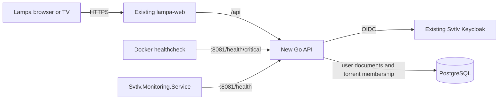

# Lampa Svtlv User Data Persistence Design

Status: Draft

Date: 2026-09-15

Target branch: `svtlvtv`

## 1. Decision

Add a small Go backend that stores one Lampa user-owned data document per signed-in
user. Device settings stay on each device.

The server is the source of truth for signed-in users:

1. User logs in.
2. Lampa requests the user's data from the server.
3. If server data exists, Lampa applies only its user-scoped fields to
   `localStorage` and uses them.
4. If server data does not exist, Lampa uploads the current user-scoped data.
5. Lampa reads the saved server data and applies only its user-scoped fields.
6. Later signed-in changes update `localStorage`; user-scoped changes replace
   the document on the server.

Anonymous users continue working exactly as they do now. Their Lampa user data
stays in browser storage, existing optional external services keep their
current behavior, and no user-data request is sent to the backend.

## 2. Scope

Persist durable user-owned data already saved by Lampa, including:

- portable content and account preferences;
- favorites and bookmarks;
- scores and reactions;
- subscriptions;
- watched state and playback progress;
- useful history;
- other durable personal data discovered during the ownership audit (§10.3).

Keep playback engines, hardware and network configuration, temporary caches,
current navigation state, device-detection values, temporary request data and
authentication tokens owned by another service out of the user document. The
scope of each concrete storage key is defined in §10.3 before synchronization.
TorrServer's own saved torrents and timecodes are separate from browser storage
and require the handling in §10.4.

This work does not install, upgrade, configure or proxy Lampa, TorrServer or
Jackett. Those services already work and must remain unchanged.

It also does not modify Lampa's generated frontend bundle or compiled stylesheet.
Receiving frontend updates from the fork/upstream must remain routine.

## 3. Architecture



Components:

- `lampa-web` continues serving the existing static application and proxies
  `/api` to the Go service.
- `lampa-api` handles login, sessions and user-data reads and writes.
- the existing Svtlv Keycloak identifies the user.
- PostgreSQL stores the complete user document in JSONB.
- a small ES5 browser adapter exports data from Lampa, calls the API and imports
  server data into `localStorage`.

The frontend adapter is required because a backend cannot directly read or
update browser `localStorage`.

### 3.1 Go engineering baseline: Ralphex

Use Ralphex as the engineering baseline for the new Go module. The baseline
inspected for this design is Ralphex `master` at commit `a736d5e`; re-check its
current `master` at the start of Plan 1 so the Go version and pinned tool
versions do not drift accidentally.

Ralphex is the reference for project structure, code style and quality checks,
not for Lampa's business architecture. Do not copy Ralphex CLI, dashboard or
executor dependencies into this service unless the backend actually needs
them.

Keep the Go module additive and isolated from upstream Lampa files:

```text
backend/
├── cmd/lampa-api/       # composition root and process lifecycle
├── pkg/api/             # HTTP routes, middleware and response contract
├── pkg/auth/            # Keycloak OIDC and session handling
├── pkg/config/          # typed environment configuration and validation
├── pkg/health/          # Svtlv-compatible health reports
├── pkg/storage/         # user-data service and PostgreSQL implementation
├── migrations/          # versioned PostgreSQL schema
├── Makefile
├── go.mod
├── go.sum
└── vendor/
```

Follow these Ralphex conventions:

- use the same pinned Go toolchain in `go.mod`, CI and the Docker builder
  (`go 1.26.0` in the inspected baseline);
- use `cmd/<binary>` for the entry point and small `pkg/<responsibility>`
  packages, with private internal state and explicit constructors;
- prefer the standard library, including `net/http`, and add a dependency only
  when it directly reduces necessary implementation work;
- define narrow interfaces in the consuming package, pass `context.Context` as
  the first argument to blocking or cancellable operations, and generate mocks
  with `moq` into a `mocks/` subdirectory when a generated mock is useful;
- wrap errors with operation context and `%w`, validate constructor/configuration
  inputs, set explicit HTTP timeouts, and shut the server down through a bounded
  context;
- use a small injected logger interface where test isolation requires it and
  never log user documents or secrets;
- use lowercase comments except for exported Go documentation comments;
- commit `go.mod`, `go.sum` and `vendor/`; after dependency changes run
  `go mod tidy` and `go mod vendor`.

Configuration should use typed structs, defaults and startup validation in the
same style as Ralphex, without copying Ralphex's CLI-specific `go-flags`
configuration. The files follow Svtlv's `appsettings` layering:

- `appsettings.json` holds the shared defaults and `appsettings.<Environment>.json`
  overrides only what differs (the database host and port). Both are embedded
  with `//go:embed` and decoded strictly into one struct, so an unknown key is an
  error;
- the environment comes from `LAMPA_ENVIRONMENT` (`Development`, `Test` or
  `Production`, default `Test`). Development is a local `go run` against the
  database published on loopback `5434`;
- secrets are `{ENV_VAR}` placeholders (`{LAMPA_DB_PASSWORD}`,
  `{LAMPA_API_DATA_KEY}`) resolved from the environment. Missing values fail
  startup naming the variable, never the value. No other environment variable
  overrides a file setting.

Ports follow the Svtlv series without colliding with it: the API listens on
`5800` and is published on the same host port of `LAMPA_BIND_ADDRESS`, health stays on the
container-internal `8081`, and PostgreSQL is published only on
`127.0.0.1:5434` (Svtlv uses `5433`, Keycloak `8080`).

The backend quality contract is:

- provide Ralphex-style `make build`, `make test`, `make lint`, `make fmt` and
  `make race` targets inside `backend/`;
- `make test` runs all packages with the race detector and a coverage profile;
- tests use the standard `testing` package plus `testify/assert` and
  `testify/require`, table-driven subtests, `httptest` for HTTP handlers,
  `t.Helper()` in helpers and `t.TempDir()` for filesystem work;
- keep one matching test file per source file (`foo.go` -> `foo_test.go`) and
  target at least 80% coverage for new backend code, excluding generated mocks;
- start from Ralphex's GolangCI-Lint v2 configuration, using the same enabled
  linters and settings, and pin the same linter version in CI (`v2.13.0` in the
  inspected baseline); copy only exclusions that apply to this service and
  explain every Lampa-specific suppression;
- CI runs the same race, coverage and lint checks before building an image;
  tool/action versions are pinned rather than floating silently;
- use a multi-stage Docker build with revision metadata and a minimal non-root
  runtime image.

The Ralphex commands and configuration are the source of truth when the plan is
implemented. If a Lampa-specific need requires a deviation, record the reason
in that implementation plan. Ralphex's automatic CI/release triggers are not
copied: Lampa production deployment remains `workflow_dispatch` only.

## 4. Data model

Use one row per Keycloak user:

```sql
create table lampa_user_data (
    user_id uuid primary key,
    schema_version integer not null,
    data jsonb not null,
    encrypted_connections bytea null,
    created_at timestamptz not null,
    updated_at timestamptz not null
);
```

`user_id` is the Keycloak `sub` UUID. The browser never chooses or sends a
different owner ID; the backend obtains it from the authenticated session.

The JSON document has a simple top-level structure:

```json
{
  "settings": {},
  "favorites": {},
  "bookmarks": {},
  "scores": {},
  "subscriptions": {},
  "progress": {},
  "history": {},
  "other": {}
}
```

The exact inner values follow the formats already used by Lampa. The backend
validates the allowed sections, document size and valid JSON, but it does not
create separate relational tables for every Lampa feature.

Plan 3 adds a separate membership table for TorrServer records, keyed by
`(user_id, server_id, torrent_hash)`. This is a many-to-many index, not a copy
of TorrServer's torrent database or a section of the user JSON document. Its
endpoints require the same authenticated session as user data.

If a future, explicitly portable connection profile is synchronized, its
credentials and API keys are removed from the normal JSONB value and encrypted
by the Go service into `encrypted_connections`. The API returns one logical
document after decrypting those fields for the authenticated user. Ordinary
device-local connection settings are never uploaded; Plan 1's encrypted column
does not make them user-scoped.

## 5. Authentication

Use the existing Svtlv Keycloak realm and its existing users. Create a separate
confidential OpenID Connect client named `svtlv-lampa`. Do not reuse the
`svtlv-web` client: users and Keycloak SSO are shared at realm level, while each
application keeps its own redirect URIs, client secret and session boundary.

Lampa initially requires only a valid authenticated user. It does not consume
Svtlv Web application roles. If Lampa-specific roles are ever needed, define
them as client roles on `svtlv-lampa`, not as dependencies on another client's
roles.

Recommended flow:

- the browser opens `/api/v1/auth/login`;
- the Go backend performs the Keycloak Authorization Code flow;
- the callback creates an opaque `HttpOnly`, `Secure` session cookie;
- Keycloak tokens and client secrets never enter `localStorage`;
- `/api/v1/auth/logout` ends the session;
- `/api/v1/session` reports whether the browser is signed in.

Anonymous use does not require a session.

## 6. Synchronization behavior

### 6.1 Anonymous startup

1. Lampa starts normally.
2. It reads and writes its current browser storage.
3. The sync adapter does not call the user-data API.

Result: behavior is the same as the current application.

### 6.2 Login when server data exists

1. Complete Keycloak login.
2. Call `GET /api/v1/user-data`.
3. Receive the complete server document.
4. Replace only the user-scoped Lampa values in `localStorage` with that document.
5. Refresh or restart the affected Lampa components.

The previous local user values do not overwrite existing server data. The
server document wins for user-scoped fields; device settings stay local.

### 6.3 Login when server data does not exist

1. Complete Keycloak login.
2. Call `GET /api/v1/user-data`.
3. Receive `404 Not Found` with error code `user_data_not_found`.
4. Export the current user-scoped durable Lampa values from browser storage.
5. Call `PUT /api/v1/user-data` with the complete document.
6. Call `GET /api/v1/user-data` again.
7. Apply only its user-scoped values to `localStorage`.

This is the only automatic import of pre-login local data. Existing server data
is never silently replaced during login.

### 6.4 Changes while signed in

1. Lampa writes the change to `localStorage` as it does today.
2. If its key is user-scoped, the adapter waits for a short debounce period.
3. The adapter exports the complete durable document.
4. It calls `PUT /api/v1/user-data`.
5. A successful response means the server has accepted the new source-of-truth
   document.

Multiple changes during the debounce period produce one server write.

### 6.5 Later startup or refresh

When an authenticated session exists, Lampa gets the server document before
normal synchronized data is used. Server values replace only the synchronized
user-scoped local values.

If the server is temporarily unavailable, Lampa continues with its current
local data and displays a small synchronization error. It must not clear local
storage because of a network error.

## 7. Conflict policy

The first version deliberately uses a simple policy:

- the server stores one complete document;
- each successful `PUT` replaces the previous document;
- the last successful save wins;
- login and startup always prefer the server document;
- there is no field-level merge, change cursor, mutation log or tombstone table.

This means two devices editing at the same time can overwrite each other's last
changes. That is an accepted first-version limitation. More complex merging
should be added only if real usage demonstrates the need.

## 8. API

| Method and path | Purpose |
| --- | --- |
| `GET /api/v1/auth/login` | Start Keycloak login |
| `GET /api/v1/auth/callback` | Finish login and create session |
| `POST /api/v1/auth/logout` | End session |
| `GET /api/v1/session` | Return login status |
| `GET /api/v1/user-data` | Return the signed-in user's complete document |
| `PUT /api/v1/user-data` | Create or replace the complete document |
| `DELETE /api/v1/user-data` | Delete the signed-in user's cloud document |
| `GET /api/v1/torrservers/{server_id}/hashes` | Return this user's claimed hashes for one configured TorrServer; Plan 3 |
| `PUT /api/v1/torrservers/{server_id}/hashes/{hash}` | Claim a successfully added torrent for this user; Plan 3 |
| `DELETE /api/v1/torrservers/{server_id}/hashes/{hash}` | Remove only this user's claim; Plan 3 |
| `GET :8081/health` | Return all critical and advisory health checks |
| `GET :8081/health/critical` | Return only Docker-critical health checks |

Example successful response:

```json
{
  "schema_version": 1,
  "data": {
    "settings": {},
    "favorites": {},
    "bookmarks": {},
    "scores": {},
    "subscriptions": {},
    "progress": {},
    "history": {},
    "other": {}
  },
  "updated_at": "2026-09-15T12:00:00Z"
}
```

The API requires authentication for every user-data and torrent-membership
operation, limits request size and never accepts a `user_id` from the request
body or URL. Membership operations must be idempotent.

## 9. Health and Svtlv monitoring

The Go service must reproduce the existing Svtlv two-tier health contract even
though it cannot reference the .NET `Svtlv.Common.HealthChecks` library.

Both endpoints listen on container-internal HTTP port `8081` and are not
published to the host or proxied through the public Lampa origin. Their consumers
are intentionally separate: Docker Compose calls only `/health/critical`, while
`Svtlv.Monitoring.Service` calls only `/health`.

### 9.1 Endpoints

- `/health` runs every critical and advisory check. `Svtlv.Monitoring.Service`
  consumes this endpoint; operators may also use it for diagnosis.
- `/health/critical` runs only critical checks. It is used exclusively by the
  Docker Compose healthcheck.
- health endpoints require no user login because they are private network
  endpoints.

Initial checks:

| Check | Tier | Meaning |
| --- | --- | --- |
| `database` | Critical | PostgreSQL is reachable and the required schema is usable |
| `keycloak` | Advisory | Keycloak discovery/login dependency is reachable |

A database failure makes persistence unusable and returns `Unhealthy` from both
endpoints. A Keycloak failure prevents new logins but does not invalidate
existing sessions or justify restarting the API, so `/health` becomes
`Degraded` while `/health/critical` remains `Healthy`.

Plan 1 ships only the `database` check; `keycloak` is added in Plan 2 (see the
Plan 1 deviations in §14).

### 9.2 JSON contract

Both endpoints return the same camel-case document shape used by Svtlv:

```json
{
  "status": "Healthy",
  "totalDurationMs": 1.234,
  "checks": [
    {
      "name": "database",
      "status": "Healthy",
      "description": "PostgreSQL is reachable.",
      "durationMs": 1.123,
      "error": null
    }
  ]
}
```

Allowed status strings are `Healthy`, `Degraded` and `Unhealthy`. HTTP status
mapping must also match Svtlv:

- `Healthy` -> `200`;
- `Degraded` -> `200`;
- `Unhealthy` -> `503`.

The JSON document and each check's `status` are authoritative. A `200` response
does not prove health because advisory failures deliberately return
`Degraded` with HTTP `200`.

Descriptions and errors must be short and must never contain connection
strings, credentials, user data or Keycloak tokens.

### 9.3 Docker healthcheck

The `lampa-api` container uses the critical endpoint:

```yaml
healthcheck:
  test: ["CMD-SHELL", "curl -fsS http://localhost:8081/health/critical || exit 1"]
  interval: 30s
  timeout: 10s
  retries: 5
  start_period: 30s
```

### 9.4 Svtlv.Monitoring.Service target

The Lampa deployment and Monitoring service must share a private Docker network
or another private route on which `lampa-api:8081` is resolvable. Add this target
to the Svtlv monitoring configuration when the API is deployed:

```json
{
  "Id": "lampa-api",
  "Name": "Lampa API",
  "Kind": "Url",
  "Enabled": true,
  "Severity": "Critical",
  "Interval": "00:01:00",
  "Timeout": "00:00:05",
  "Url": {
    "Url": "http://lampa-api:8081/health",
    "Evaluator": "HealthReport",
    "StatusPolicy": "Reachable",
    "TreatDegradedAs": "Alert"
  }
}
```

Monitoring must call `/health`, not `/health/critical`, so it can notify about
both `Unhealthy` critical checks and `Degraded` advisory checks. Docker remains
the independent consumer of `/health/critical`.

## 10. Browser integration and upstream compatibility

Keep all fork-specific frontend integration outside the generated Lampa files:

```text
svtlv/
├── torrserver-ownership.js   # Plan 3, shared TorrServer view
├── account-sync.js           # Plan 4, user document sync
└── account-sync.css
```

Add only clearly marked script and stylesheet includes to `index.html`.
`app.min.js` is loaded asynchronously and may come from the local distribution
or an Android-provided remote URL, so `account-sync.js` must wait until the
public `window.Lampa` API is available before initializing.

The adapter must use ES5 syntax and public Lampa/jQuery APIs because the
application supports older TV browsers. In particular, observe changes through
`Lampa.Storage.listener.follow('change', ...)`; do not replace `localStorage`,
patch `Lampa.Storage.set`, or depend on generated internal names with `$N`
suffixes.

The synchronization adapter has four small responsibilities:

1. `exportData()` reads only the approved user-scoped durable values.
2. `importData(data)` writes only those values into the correct local stores.
3. `loadFromServer()` implements the login/startup flow.
4. `saveToServer()` debounces and uploads the complete document.

Do not replace the global `localStorage` object or send every storage key
blindly. Export/import code must use an explicit key allowlist, preserving
device-local values on login, account change, refresh and logout. Unknown keys
stay local until classified; newly added upstream settings do not automatically
become user data.

### 10.1 Hard compatibility rules

- Do not edit `app.min.js` for account, login or synchronization behavior.
- Do not edit compiled `css/app.css`; use `svtlv/account-sync.css`.
- Do not modify upstream language bundles for the first version; keep the small
  Svtlv UI text inside the add-on until upstream-safe localization is designed.
- Use only stable names exported through `window.Lampa`.
- Treat the add-on as optional: missing configuration, backend failure, script
  failure or API incompatibility must leave normal anonymous Lampa working.
- Keep backend, database, deployment and documentation files in additive
  directories that upstream Lampa does not own.
- Any future requirement to edit a generated upstream file needs an explicit
  design decision; it is not part of normal implementation.

### 10.2 Minimal loader seam

The intended frontend conflict surface is limited to the marked includes in
`index.html`. The add-on initializes itself only after `window.Lampa` is ready
and catches initialization errors without interrupting Lampa boot.

This works for both current loader branches:

- local `app.min.js`;
- an Android-provided remote `app.min.js` with local fallback.

When frontend updates are received, take the updated upstream distribution
files as-is, preserve the small marked `index.html` includes and run the Lampa
smoke checks. The additive integrations remain in `svtlv/` and should not
participate in conflicts inside the generated bundle.

### 10.3 Storage ownership audit (separate Plan 3)

Use the currently shipped bundle as the initial inventory and verify each key
against its read/write sites when implementing Plan 3. Classification is by
meaning, not by a broad `settings` object or a `player_` prefix alone:

| Scope | Examples and rule |
| --- | --- |
| User document | `favorite`, `mine_reactions`, `person_subscribes_id`, `user_clarifys`, `search_history`, `online_view`, `online_watched_last`, `torrents_view`, and the appropriate local bookmark, history, watched and `file_view*` progress keys. `online_watched_last` and `torrents_view` are durable viewed/progress data despite being read through `Storage.cache`. `language` and `tmdb_lang` are candidates for portable content preferences; check their consumers before allowing them. |
| Device only | `player`, `player_iptv`, `player_torrent`, `player_nw_path`, `infuse_launch_mode`, `player_volume`, `player_size`, `player_speed`, `player_normalization*`, `player_scale_method`, `player_hls_method`, `player_subs_shift_time`, `player_rewind`, `player_timecode`, `player_external_fullscreen`, `player_launch_trailers`, `playlist_next`, `webos_subs_params`, `subtitles_*`, `video_quality_default`, `navigation_type`, `keyboard_type`, `keyboard_default_lang`, `interface_size`, `interface_sound_*`, `screensaver*`, `device_name`, `platform`, `native`, `full_btn_priority`, `parental_control*` including its PIN, `developer_*`, and device identifiers. A TV, PC and phone can legitimately use different engines, paths, controls and rendering. |
| Connection or external account state | `torrserver_url*`, `torrserver_use_link`, `torrserver_login/password`, `jackett_url*/key*`, `prowlarr_url*/key*`, parser source/link selection, `tmdb_proxy*`, `proxy_*`, `tmdb_img_mirror`, `cub_domain` and `torrserver_tracktimecode` stay device-local by default. `account*` CUB state, CUB tokens and third-party account data remain owned by that service; Keycloak login must not copy them. |
| Generated, cache or session state | `activity`, `torrents_filter_data`, `recomends_*`, `timetable`, `cub_alive`, `metric_*`, `vast_device_*`, `lampa_uid`, `storage_*_update_time`, `terminal_access` and other transient, generated or credential-bearing keys are excluded unless a specific read/write audit proves a user-owned subset. |

`plugins` and `plugins_blacklist` need an explicit portability decision because
scripts can depend on the platform and run as code; keep them local in the first
sync release. `menu_sort`, `menu_hide` and `start_page` also need a device audit
because installed features can differ by device. `torrserver_savedb` controls
writes to a particular TorrServer and is local to that connection. Classify
ambiguous UI preferences one by one;
the safe default is local. For keys such as `file_view*` that already include a
CUB profile suffix, map only the active local profile's data and never import a
different CUB account's records. Preserve the current device's values during
initial upload and every server import. Test one account on TV, PC and phone
with distinct player and TorrServer settings. Audit existing CUB account and
`Storage.sync` paths for overlapping writes so CUB and the new adapter do not
silently replace one another's user data.

### 10.4 TorrServer data ownership (separate Plan 3)

The bundle calls `Torserver.my()` -> `POST /torrents` with `action: list` for
My Torrents. Both explicit Add to My Torrents and playback with
`torrserver_savedb` can write `action: add`; removal calls `action: rem`.
These records are in TorrServer, not in `localStorage`, so exporting browser
keys alone cannot isolate them. TorrServer's `/viewed` timecodes are another
shared store when `torrserver_tracktimecode` is enabled.

For signed-in users, keep TorrServer's torrent data flat but store membership
in `lampa-api` as `(Keycloak user_id, configured TorrServer identity, torrent
hash)`. A hash can belong to several users. After a successful add, record the
membership; My Torrents must obtain the authenticated user's allowed hashes
before it renders any TorrServer rows and fail closed if that lookup fails.
Removing a torrent from My Torrents removes this user's membership; it does not
delete the shared TorrServer record. Physical cleanup remains a separate
operator action because anonymous users and other clients can use it. Use a stable,
non-secret server ID configured consistently on devices that reach the same
instance, rather than the current URL text, which may differ between devices.
The ownership API derives the user from the session, validates the server ID
and hash, and never trusts a user ID in the request. The add integration must
use the canonical hash returned or confirmed by TorrServer, not assume that a
magnet URL or movie ID is the saved record's hash.

Unknown pre-existing TorrServer entries have no owner. Do not assign all of
them to the first account that logs in or expose them in signed-in My Torrents.
Leave them hidden until an operator explicitly assigns ownership after checking
the legacy records. For anonymous users, preserve the current unfiltered behavior.
Record/reconcile add and remove failures so an unsuccessful TorrServer request
does not create a visible phantom membership. Confirm a public `window.Lampa`
integration seam for the My Torrents list and add/remove calls before deploying
the filter; the currently shipped component reads `Torserver.my()` directly.
If the seam cannot filter before rendering, keep the signed-in list disabled
until an additive frontend integration is ready.

This is **application view separation**, not TorrServer access control. Anyone
with direct access to the shared TorrServer or its credentials can still list
or remove its records. Strong isolation would require separate TorrServer
accounts/instances or an authenticated proxy that also blocks direct access.
Do not describe the filtered view as a security boundary. Separately, do not
merge `/viewed` timecodes across users: use Lampa's user-scoped local playback
progress for signed-in users unless a verified per-user TorrServer namespace is
available. Verify this behavior before enabling synchronization.

## 11. Failure behavior

- No server document: upload current user-scoped local data, read it back and use it.
- API unavailable during login: keep current local data and show sync as
  unavailable; do not initialize the server document.
- API unavailable during save: keep the local change and show that it has not
  been saved to the server. A later save may retry the complete current
  document.
- PostgreSQL unavailable: both health endpoints report `Unhealthy`, the Docker
  critical probe fails and user-data endpoints return a temporary error.
- Keycloak unavailable: anonymous mode and already-loaded local data continue
  working; new login fails cleanly and `/health` reports `Degraded`.
- Invalid server document: reject it and keep the current local values.

## 12. Security

- Serve login and API traffic through HTTPS.
- Use `HttpOnly`, `Secure` and appropriate `SameSite` session cookies.
- Protect modifying requests against CSRF.
- Derive ownership only from the authenticated Keycloak session.
- If portable connection profiles are ever enabled, encrypt their credentials
  and API keys before database storage; keep current device-local credentials
  out of user-data requests.
- Never log user documents, connection values, credentials or Keycloak tokens.
- Limit JSON nesting, section sizes and total request size.
- Keep the API and PostgreSQL ports private.
- Keep port `8081` and detailed health responses private to Docker and the
  monitoring network.

## 13. Existing deployment

The existing Lampa, TorrServer and Jackett services are the working baseline.
They are not recreated or reconfigured by this project.

Deployment work only adds:

- the `lampa-api` image;
- PostgreSQL database access for that API;
- the Apache `/api` reverse proxy;
- backend secrets and migration execution;
- the Svtlv-compatible health endpoints and Docker critical healthcheck;
- private network reachability from `Svtlv.Monitoring.Service`;
- Ralphex-style Go build, race-test, coverage and lint gates in a `tests.yaml`
  workflow next to the existing manual CI/CD workflow.

Disabling the API/sync feature must return Lampa to its current anonymous,
local-only behavior.

## 14. Roadmap

Each step is one separate implementation plan. Complete and verify the plans in
this order. There is no final standalone CI/CD or deployment plan: every plan
must include the tests, image, Docker Compose, manual CI/CD, deployment,
healthcheck, smoke verification and rollback changes required by its feature.
The deployment workflow remains manual-only and remote server commands continue
to use `docker-compose`.

### Plan 1: Build and deploy the Go persistence service

Re-check the current Ralphex baseline and create the isolated `backend/` Go
module with its package layout, Make targets, vendoring, GolangCI-Lint v2
configuration and test conventions. Create the Go API and its PostgreSQL table
containing one JSONB document per user. Implement user-data read, replace and
delete operations, sensitive-value encryption, validation, table-driven tests,
and the Svtlv-compatible `/health` and `/health/critical` endpoints. In the same
plan, create the multi-stage backend image, add the API and database connection
to Docker Compose, run the Ralphex-style race/coverage/lint gates before image
build in the manual CI/CD workflow, add the Docker `/health/critical` probe,
register `/health` in `Svtlv.Monitoring.Service`, deploy it and verify rollback.

Result: the backend is running and monitored on the server and can securely
store and retrieve isolated user documents.

Deviations recorded while implementing Plan 1
(`docs/plans/20260918-lampa-api-persistence.md`):

- the `keycloak` advisory check (§9.1) is deferred to Plan 2, when a Keycloak
  issuer URL exists. Plan 1 ships only the critical `database` check; the
  advisory tier and `Degraded` aggregation are implemented and tested with fakes;
- the Apache `/api` reverse proxy (§13) is deferred to Plan 2, when login needs
  it. `lampa-api` joins the default Compose network so `lampa-web` can reach it,
  and user-data routes answer `401` until Plan 2 plugs in authentication;
- PostgreSQL is pinned to `postgres:18.6`, in Compose and in testcontainers.
  Postgres 18+ images keep data in a versioned subdirectory, so the volume is
  mounted at `/var/lib/postgresql`, not `/var/lib/postgresql/data`;
- rollback reverts the commit and dispatches the workflow again, as in Svtlv;
  its only input is `environment`. The workflow builds `:latest` images, swaps
  them for the `:dev` images of `devops/docker-compose.yaml` and strips the
  `build:` blocks. The backend gates run in the separate `tests.yaml` workflow
  on every PR and push to `svtlvtv`, not inside the deploy;
- the API port is published (`5800`, on `LAMPA_BIND_ADDRESS` like the web port)
  for local and server smoke checks, which departs from §12 until the Plan 2
  `/api` proxy exists; user-data routes still answer `401` until Plan 2;
- the sealed credential set mirrors the secret inputs of the current Lampa
  settings UI: the TorrServer login and password and the Jackett **and
  Prowlarr** API keys (`SensitiveSettings`). A drift test parses `app.min.js`
  and fails when upstream adds a settings input classified neither as sealed nor
  as plain, or removes a sealed one. Settings registered by
  plugins through `SettingsApi` are unknown to the backend and are stored as
  plain settings.

### Plan 2: Add and deploy Keycloak authentication

Create the confidential `svtlv-lampa` client inside the existing `svtlv` realm.
Implement login, callback, session status and logout. Validate the Keycloak
`sub` UUID and make it available to authenticated backend handlers, but do not
connect the Lampa frontend to the user-data API yet. Add the new Keycloak
configuration and secret to Compose and the manual deployment workflow, deploy
the change and verify login, session identity, session expiry and rollback.

Result: existing Svtlv users can sign in and Lampa can recognize the active
session. Settings, favorites, bookmarks, scores and every other Lampa value
still read from and write only to the device's existing `localStorage`. Login
does not download, upload or replace any user data in this plan.

### Plan 3: Classify storage and separate shared TorrServer data

After Plan 2 provides an authenticated session, audit the current bundle's
storage keys and read/write sites, then publish an explicit allowlist of
user-scoped keys and an exclusion list for device, external-account and cache
state (§10.3). Keep this work separate from the already started Plan 1 and
from the later browser synchronization rollout. Add the authenticated
TorrServer membership API and additive browser integration for My Torrents
and add/remove operations (§10.4). Verify that the signed-in list filters
before rendering, that a hash can belong to two users, that removing one
membership preserves the other's entry, and that anonymous access remains as
before. Address shared `/viewed` timecodes by keeping them out of the signed-in
flow unless a verified per-user namespace exists. Include tests, deployment,
monitoring, smoke checks on two accounts and two devices, and rollback for the
new API and integration. Do not edit generated frontend files.

Result: each storage key has an explicit scope, and signed-in My Torrents
shows only entries claimed by that user. Direct access to a shared TorrServer
remains outside this view-level separation.

### Plan 4: Synchronize and deploy user-scoped Lampa data

Add the optional ES5 sync adapter under `svtlv/` using the marked loader seam
established in Plan 3. This plan makes the first frontend calls to the user-data API
and connects the authenticated Keycloak `sub` to its server document. Implement
the server-first login flow for the Plan 3 allowlist: portable preferences,
favorites, bookmarks, scores, reactions, subscriptions, watched state,
playback progress, history and other verified user-owned data. Preserve each
device's player, connection and platform settings; exclude caches, CUB-owned
state and unrelated tokens. Do not change `app.min.js` or `css/app.css`. In the
same plan, add frontend checks and the updated web image to the manual CI/CD
workflow, deploy behind the sync feature flag, verify the complete flow on
two devices with different player and TorrServer settings, and verify rollback.

Result: anonymous mode remains local-only, while a signed-in user receives the
same user-owned state on every device without changing its local playback or
network configuration. The deployed feature can be disabled to restore the
original behavior.

## 15. Acceptance criteria

The design is complete when:

- anonymous users work exactly as before and use only local storage;
- a signed-in user with server data always receives and uses that data;
- a signed-in user without server data uploads the current local data once;
- later signed-in changes update both local storage and the server document;
- the same Keycloak user receives the same user-owned data on another device,
  while each device retains its player and connection settings;
- signed-in My Torrents shows only entries claimed by that user, including
  when two users claim the same torrent hash; one user's removal does not
  remove the other's membership;
- TorrServer `/viewed` timecodes do not mix progress between signed-in users;
- anonymous My Torrents keeps the existing behavior, while failures of the
  ownership lookup never show a signed-in user the unfiltered list;
- one user cannot access another user's API document or membership, and the
  signed-in My Torrents view cannot show another user's claims; direct access
  to a shared TorrServer remains outside this guarantee;
- backend code follows the current Ralphex package, formatting, lint, test,
  vendoring and Docker conventions, with documented exceptions only;
- temporary backend failure does not stop normal local Lampa operation;
- Docker evaluates `/health/critical`, while `Svtlv.Monitoring.Service`
  evaluates the full `/health` JSON and sends notifications for bad checks;
- frontend updates can be received without merging synchronization code inside
  `app.min.js`, `css/app.css` or upstream language bundles;
- failure of the optional Svtlv add-on never prevents original Lampa startup;
- existing TorrServer and Jackett service configuration remains unchanged.

## 16. Open decision

Logout needs one explicit product rule:

- keep the last synchronized user values in `localStorage` and continue anonymously
  with them; or
- clear only synchronized user values on logout so the next person using the
  device does not see the signed-in user's data. Device settings remain local.

The second option is safer for shared devices. Preserving a separate pre-login
guest snapshot can be added later only if it is actually needed.
